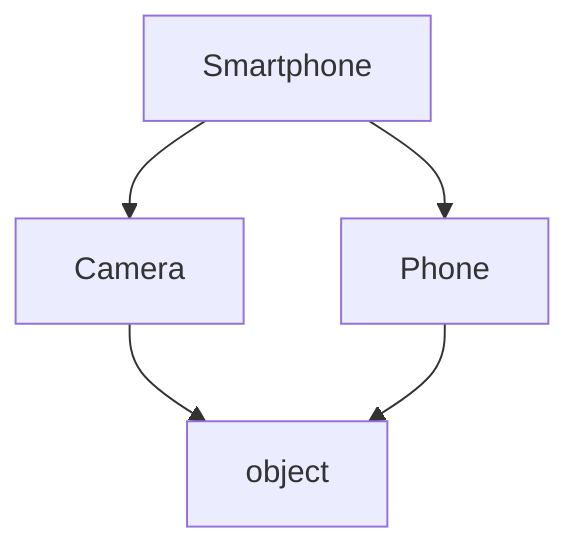
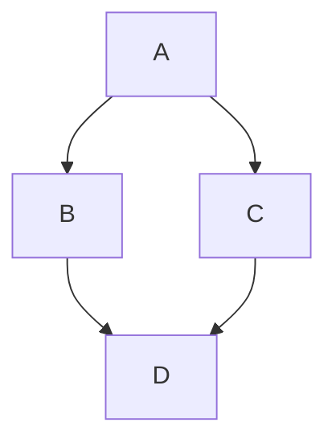
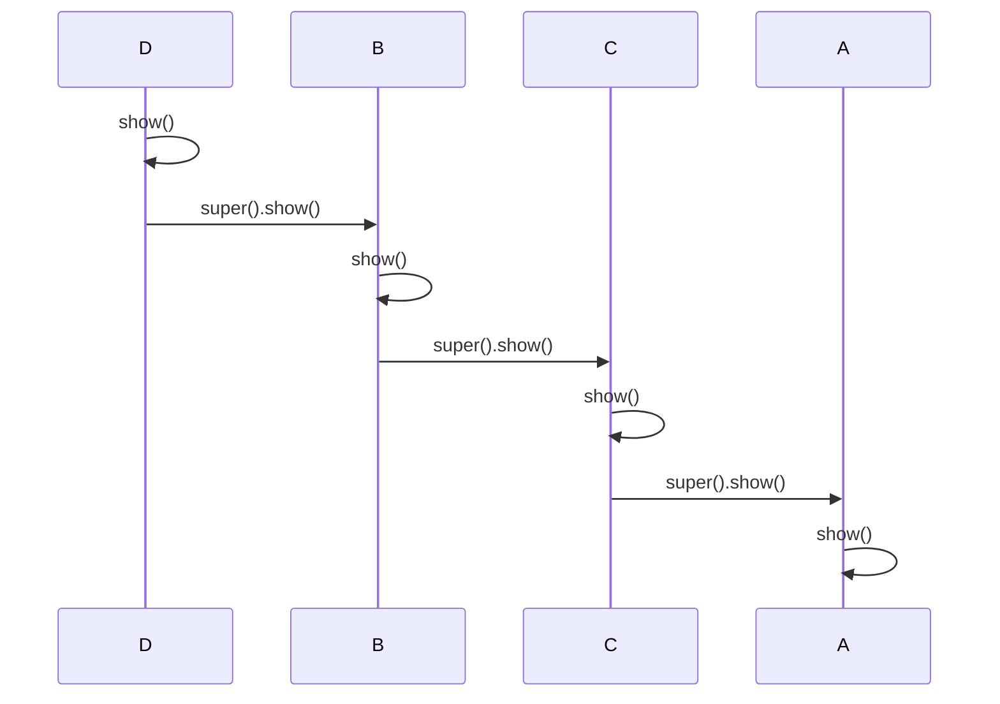

# Method Resolution Order (MRO) in Python

**Navigation:** [Core OOP plan](learning_plan.md) | [Main roadmap](../learning_roadmap.md) | [Python functions plan](../python_functions/learning_plan.md) | [OOP + Python features plan](../oop_python_features/learning_plan.md)

## 1. What is MRO?

**Method Resolution Order (MRO)** is the order Python follows when it searches for a method or attribute in a class hierarchy.

When you call a method on an object, Python checks the class and its parent classes according to the MRO. The first matching method is used.

```python
class Animal:
    def speak(self):
        print("Animal speaks")


class Dog(Animal):
    def speak(self):
        print("Dog barks")


dog = Dog()
dog.speak()
```

Output:

```text
Dog barks
```

Python checks `Dog` first. Since `Dog` contains `speak()`, Python does not need to search `Animal`.

## 2. Simple Inheritance MRO

```text
Dog
 |
Animal
 |
object
```

The lookup order is:

```text
Dog -> Animal -> object
```

`object` is the root class from which Python classes ultimately inherit.

You can inspect the MRO in two ways:

```python
print(Dog.mro())
print(Dog.__mro__)
```

Typical output:

```text
[<class '__main__.Dog'>, <class '__main__.Animal'>, <class 'object'>]
(<class '__main__.Dog'>, <class '__main__.Animal'>, <class 'object'>)
```

## 3. When the Child Does Not Define the Method

If the child class does not define a method, Python continues searching in the parent class.

```python
class Vehicle:
    def start(self):
        print("Vehicle starts")


class Car(Vehicle):
    pass


car = Car()
car.start()
```

Output:

```text
Vehicle starts
```

The search is:

```text
Car -> Vehicle -> object
      found start()
```

## 4. Multiple Inheritance

A class can inherit from more than one parent class.

```python
class Camera:
    def feature(self):
        print("Takes photos")


class Phone:
    def feature(self):
        print("Makes calls")


class Smartphone(Camera, Phone):
    pass


smartphone = Smartphone()
smartphone.feature()
print(Smartphone.mro())
```

Output:

```text
Takes photos
[<class '__main__.Smartphone'>, <class '__main__.Camera'>,
 <class '__main__.Phone'>, <class 'object'>]
```

The MRO is:

```text
Smartphone -> Camera -> Phone -> object
```

Because `Camera` appears before `Phone`, `Camera.feature()` is called.

### Multiple inheritance visual



## 5. The Diamond Problem

The diamond problem occurs when two parent classes inherit from the same grandparent.

```text
        A
       / \
      B   C
       \ /
        D
```

Python must decide:

- When should `A` be searched?
- Should `A` be searched more than once?
- Which parent should be searched first: `B` or `C`?

Python solves this using the **C3 linearization algorithm**.

```python
class A:
    def show(self):
        print("A")


class B(A):
    pass


class C(A):
    pass


class D(B, C):
    pass


print(D.mro())
```

Output:

```text
[<class '__main__.D'>, <class '__main__.B'>,
 <class '__main__.C'>, <class '__main__.A'>,
 <class 'object'>]
```

The MRO is:

```text
D -> B -> C -> A -> object
```

### Diamond inheritance visual



## 6. How `super()` Uses the MRO

`super()` continues method lookup from the next class in the MRO. It does not simply mean "call my direct parent".

```python
class A:
    def show(self):
        print("A")


class B(A):
    def show(self):
        print("B")
        super().show()


class C(A):
    def show(self):
        print("C")
        super().show()


class D(B, C):
    def show(self):
        print("D")
        super().show()


value = D()
value.show()
```

Output:

```text
D
B
C
A
```

The calls follow this chain:

```text
D.show()
    |
    v
B.show()
    |
    v
C.show()
    |
    v
A.show()
```

The MRO explains why `C.show()` is called after `B.show()`: the MRO of `D` is `D, B, C, A, object`.



## 7. Why Cooperative Multiple Inheritance Matters

For `super()` to work correctly in multiple inheritance, every class should generally:

1. Use the same method name.
2. Call `super()` instead of naming a parent directly.
3. Accept compatible arguments.
4. Allow the next class in the MRO to participate.

Prefer this:

```python
class Child(Parent):
    def process(self):
        print("Child processing")
        super().process()
```

Instead of this:

```python
class Child(Parent):
    def process(self):
        print("Child processing")
        Parent.process(self)
```

Calling `Parent.process(self)` directly skips the rest of the MRO. That can break cooperative multiple inheritance.

## 8. A Practical Example with Shared Behavior

```python
class Logger:
    def save(self):
        print("Logging save operation")
        super().save()


class Database:
    def save(self):
        print("Saving to database")
        super().save()


class Base:
    def save(self):
        print("Base save complete")


class Application(Logger, Database, Base):
    pass


application = Application()
application.save()
print(Application.mro())
```

Output:

```text
Logging save operation
Saving to database
Base save complete
[<class '__main__.Application'>, <class '__main__.Logger'>,
 <class '__main__.Database'>, <class '__main__.Base'>,
 <class 'object'>]
```

Each class contributes to the operation because each class calls `super()`.

## 9. Finding a Method Manually

For an object created from `D`, Python searches classes in this order:

```python
class A:
    value = "A"


class B(A):
    value = "B"


class C(A):
    pass


class D(B, C):
    pass


item = D()
print(item.value)
```

Search process:

```text
1. Check D       -> value not found
2. Check B       -> value found: "B"
3. Stop searching
```

Output:

```text
B
```

## 10. Useful MRO Tools

```python
print(MyClass.mro())
print(MyClass.__mro__)
help(MyClass)
```

- `MyClass.mro()` returns the MRO as a list.
- `MyClass.__mro__` returns the MRO as a tuple.
- `help(MyClass)` displays class information, including the method resolution order.

## 11. Inconsistent MRO

Python raises `TypeError` when a class hierarchy cannot have a consistent MRO.

```python
class X:
    pass


class Y(X):
    pass


# This is invalid because the requested order conflicts.
# class Invalid(X, Y):
#     pass
```

`Y` already comes after `X`, so asking Python to place `X` before `Y` through one path and `Y` before `X` through another path can create an impossible ordering.

## 12. Key Takeaways

- MRO controls method and attribute lookup.
- Python checks the current class before its parent classes.
- MRO is essential for multiple inheritance.
- Python uses C3 linearization to calculate a consistent MRO.
- `ClassName.mro()` and `ClassName.__mro__` show the order.
- `super()` follows the next class in the MRO.
- The first matching method or attribute is used.
- Calling a parent class directly can skip other classes in the MRO.
- Cooperative classes use `super()` so every class can participate.
